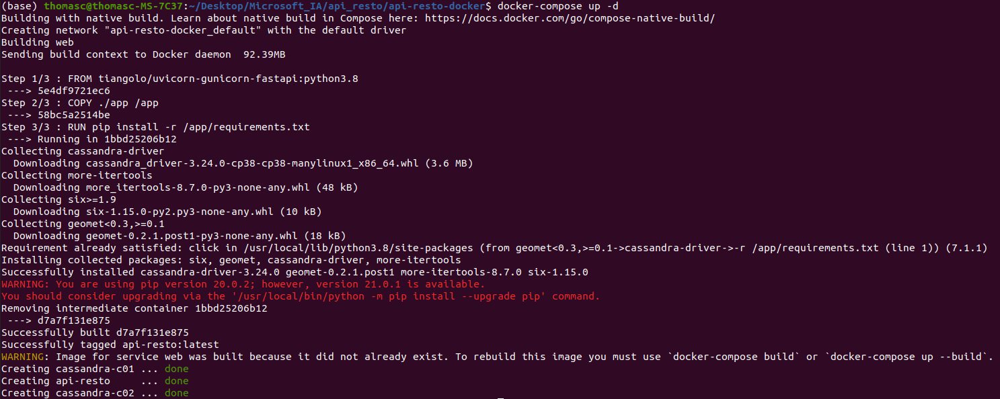
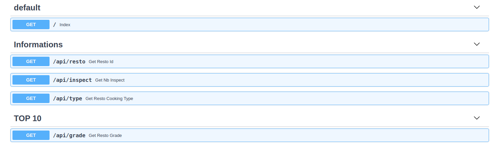

# Installation

```bash
git clone https://github.com/ChainYo/api-resto-docker
```

```bash
cd path/to/cloned/repository
```

You need to check your Docker installation with `docker --version`.  
Check [this link](https://docs.docker.com/engine/install/) if you don't have Docker already installed.

```bash
docker-compose up -d
```

You should get this:



# API Access

Go there : http://localhost:88/

To check which API endpoints are accessible, go there : http://localhost:88/docs



---

If this github repository helped you, you can star it by clicking on the `Star` button on the top right corner of this github page.

You can also `Fork` it, if you want to.

Finally feel free to PR if you want to add something usefull. Cheers :)